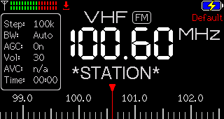

# User Manual

## Controls

Controls are implemented through the knob. The knob has quick press, long press, press and twist, and press and hold.

| Gesture         | Result              |
|-----------------|---------------------|
| Click           | Opens menu, selects |
| Long press      | Volume              |
| Press and hold  | Screen on/off       |
| Press and twist | Scan up or down     |

## Bands table

| Name | Min frequency | Max frequency | Type | Modes |
|------|---------------|---------------|------|-------|
|      |               |               |      |       |

## Serial interface

A USB-serial interface is available to control and monitor the receiver. A list of commands:

| Button       | Function            | Comments                                                                                   |
|--------------|---------------------|--------------------------------------------------------------------------------------------|
| <kbd>R</kbd> | Rotate Encoder Up   | Tune the frequency up, scroll the menu, etc                                                |
| <kbd>r</kbd> | Rotate Encoder Down | Tune the frequency down, scroll the menu, etc                                              |
| <kbd>e</kbd> | Encoder Button      | The <kbd>p</kbd> emulates a single push and can not be used for EEPROM reset or long press |
| <kbd>V</kbd> | Volume Up           |                                                                                            |
| <kbd>v</kbd> | Volume Down         |                                                                                            |
| <kbd>B</kbd> | Next Band           |                                                                                            |
| <kbd>b</kbd> | Previous Band       |                                                                                            |
| <kbd>M</kbd> | Next Mode           | Next modulation                                                                            |
| <kbd>m</kbd> | Previous Mode       | Previous modulation                                                                        |
| <kbd>S</kbd> | Next step           |                                                                                            |
| <kbd>s</kbd> | Previous step       |                                                                                            |
| <kbd>W</kbd> | Next Bandwidth      |                                                                                            |
| <kbd>w</kbd> | Previous Bandwidth  |                                                                                            |
| <kbd>A</kbd> | AGC/Att Up          | Automatic Gain Control or Attenuator up                                                    |
| <kbd>a</kbd> | AGC/Att Down        | Automatic Gain Control or Attenuator down                                                  |
| <kbd>L</kbd> | Backlight Up        |                                                                                            |
| <kbd>l</kbd> | Backlight Down      |                                                                                            |
| <kbd>I</kbd> | Calibration Up      |                                                                                            |
| <kbd>i</kbd> | Calibration Down    |                                                                                            |
| <kbd>O</kbd> | Sleep On            |                                                                                            |
| <kbd>o</kbd> | Sleep Off           |                                                                                            |
| <kbd>t</kbd> | Toggle Log          | Toggle the receiver monitor (log) on and off                                               |
| <kbd>C</kbd> | Screenshot          | Capture a screenshot and print it as a BMP image in HEX format                             |
| <kbd>@</kbd> | Get Theme           | Print the current color theme as a list of HEX numbers                                     |
| <kbd>!</kbd> | Set Theme           | Set the current color theme as a list of HEX numbers (effective until a power cycle)       |

Note: To trigger an EEPROM write, issue a <kbd>R</kbd> and <kbd>r</kbd> command whilst in VFO mode. The write occurs after 10 seconds.

The following comma separated information is sent out on the serial interface when the monitor (log) mode is enabled:

| Position | Parameter        | Function          | Comments                            |
|----------|------------------|-------------------|-------------------------------------|
| 1        | APP_VERSION      | F/W version       | Example 201, F/W = v2.01            |
| 2        | currentFrequency | Frequency         | FM = 10 kHz, AM/SSB = 1 kHz         |
| 3        | currentBFO       | BFO               | SSB = Hz                            |
| 4        | bandCal          | BFO               | SSB = Hz                            |
| 5        | bandName         | Band              | See the [bands table](#bands-table) |
| 6        | currentMode      | Mode              | FM/LSB/USB/AM                       |
| 7        | currentStepIdx   | Step              |                                     |
| 8        | bwIdx            | Bandwidth         |                                     |
| 9        | agcIdx           | AGC/Attn          |                                     |
| 10       | volume           | Volume            | 0 to 63 (0 = Mute)                  |
| 11       | remoteRssi       | RSSI              | 0 to 127 dBuV                       |
| 12       | tuningCapacitor  | Antenna Capacitor | 0 - 6143                            |
| 13       | remoteVoltage    | ADC average value | Voltage = Value x 1.702 / 1000      |
| 14       | remoteSeqnum     | Sequence number   | 0 to 255 repeating sequence         |

In SSB mode, the "Display" frequency (Hz) = (currentFrequency x 1000) + currentBFO

### Theme editor

A compile-time option called [`THEME_EDITOR`](development.md#compile-time-options) enables a special mode that helps you pick the right colors faster without recompiling and flashing the firmware each time.



Press <kbd>@</kbd> to print the current color theme to the serial console:

```shell
Color theme Default: x0000xFFFFxD69AxF800xD69Ax07E0xF800xF800xFFFFxFFFFx07E0xF800x001FxFFE0xD69AxD69AxD69Ax0000xD69AxD69AxF800xBEDFx0000xF800xFFFFxBEDFx105BxBEDFxBEDFxFFFFxD69AxD69AxFFFFxF800xC638
```

Then copy the theme to your favorite text editor, change the colors as you see (here is a handy [565 color picker](https://chrishewett.com/blog/true-rgb565-colour-picker/)).

To preview the theme, paste it to the serial console with the <kbd>!</kbd> character appended:

```shell
!x0000xFFFFxD69AxF800xD69Ax07E0xF800xF800xFFFFxFFFFx07E0xF800x001FxFFE0xD69AxD69AxD69Ax0000xD69AxD69AxF800xBEDFx0000xF800xFFFFxBEDFx105BxBEDFxBEDFxFFFFxD69AxD69AxFFFFxF800xC638
```

Once you are happy, add the resulting colors to `Theme.cpp`.

### Making screenshots

The screenshot function is intended for interface and theme designers, as well as for the documentation writers. It dumps the screen to the serial console as a BMP image in the HEX format. To convert it to an image file, you need to convert the HEX string to binary format.

A quick one-liner for macOS and Linux (change the `/dev/cu.usbmodem14401` serial port name as needed):

```shell
echo -n C | socat stdio /dev/cu.usbmodem14401,echo=0,raw | xxd -r -p > /tmp/screenshot.bmp
```
